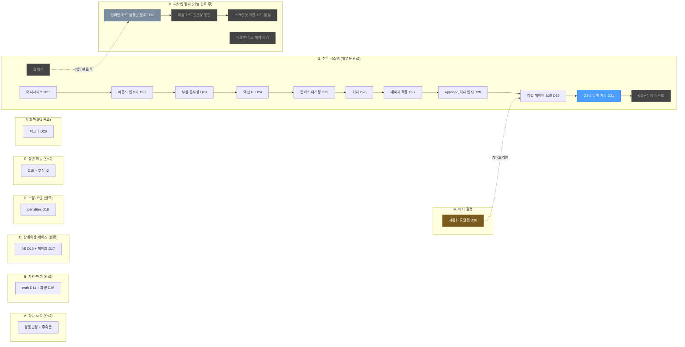
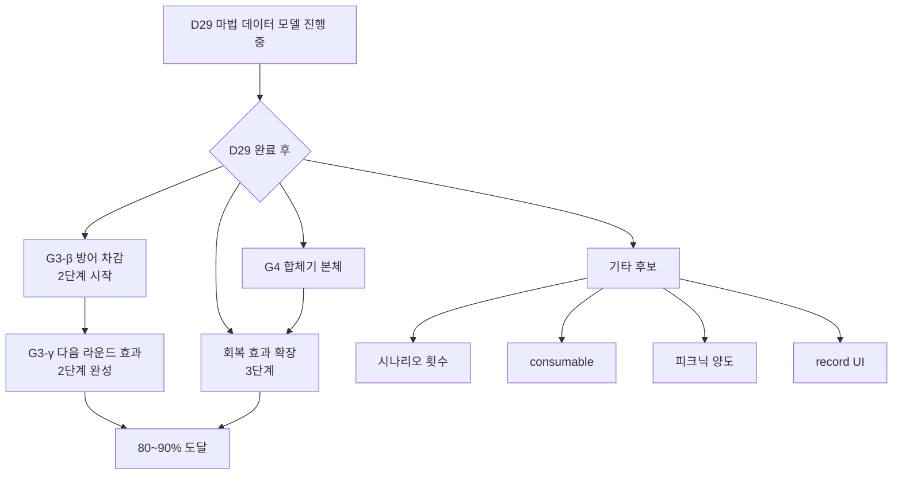

# Aster FVTT — 작업 진행 현황 (Workflow Tracker)

> 본 문서는 사용자(Sch)와 Claude가 진행한 명세 작성 STEP들의 누적 진행 현황을 트랙별로 정리합니다.
> 결정 일지는 `DECISIONS.md`, 각 명세 본문은 별도 파일 참조.
> 마지막 갱신: H 트랙(디자인 정리) 자리잡기 + D32(인라인 카드 템플릿 분리) 추가.

---

## 트랙 한눈에 보기

**범례:** 진한 박스 = 완료, 파란 박스 = 현재 작업, 회색 박스 = 미진행, 회청 박스 = 즉시 진행 예정, 황금 박스 = 메타 결정.

---

## 진행 흐름 시간순

| # | 결정 | 명세 | 주제 | 상태 |
|---|---|---|---|---|
| 01 | D1~D13 | (초기) | 기반 결정 | ✅ |
| 02 | — | EMOTION_ASTER_SPEC_REVISED | 정동판정 발생기 | ✅ |
| 03 | — | CRIT_FUMBLE_SPEC | 대성공/대실패 후속 | ✅ |
| 04 | — | OPPOSED_RESOLVE_SPEC | 대결판정 결합 카드 | ✅ |
| 05 | **D14** | CRAFT_REFUND_SPEC | craft 자동 차감 + 환불 (D3 갱신) | ✅ |
| 06 | **D15** | DERIVED_STATS_SPEC | 파생 스탯 | ✅ |
| 07 | **D16** | ACTIVE_EFFECT_SPEC | 피로·졸림 AE | ✅ |
| 08 | **D17** | PHASE_TRACKER_SPEC_V2 | 페이즈 트래커 | ✅ |
| 09 | — | SPELL_SLEEPY_SPEC | 마법 졸림 통합 | ✅ |
| 10 | — | SPELL_EXTRA_DICE_SPEC | 마법 추가 굴림 | ✅ |
| 11 | **D18** | SATIETY_PENALTIES_SPEC | penalties 통합 + 포만 감소 | ✅ |
| 12 | **D19** | SCENE_TRANSITION_SPEC | 장면 이동 | ✅ |
| 13 | **D20** | PICNIC_F1_SPEC | 피크닉 회복 | ✅ |
| 14 | — | INJURY_SCENE_SPEC | 부상 PC 건강 -2 (이동) | ✅ |
| 15 | **D21** | INITIATIVE_G1_SPEC | 이니셔티브 (민첩) | ✅ |
| 16 | (D21 보완) | INITIATIVE_AUTO_SPEC | 자동 굴림 + UI 정리 | ✅ |
| 17 | **D22** | ROUND_INFRA_G2A_SPEC | 라운드 인프라 | ✅ |
| 18 | **D23** | INJURY_COMBAT_G2B_SPEC | 부상/큰부상 + 전이 | ✅ |
| 19 | **D24** | COMBAT_ACTION_G3A_SPEC | 액션 UI (서브 탭) | ✅ |
| 20 | **D25** | CANVAS_TARGETING_SPEC | 캔버스 타게팅 | ✅ |
| 21 | **D26** | DODGE_MECHANISM_SPEC | 회피 판정 + 피로 -3 | ✅ |
| 22 | **D27** | DAMAGE_APPLY_SPEC | 대미지·상태이상 적용 | ✅ |
| 23 | **D28** | OPPOSED_DODGE_DAMAGE_SPEC | resolveOpposed 회피 인지 | ✅ |
| 24 | **D29** | SPELL_DATA_MODEL_SPEC | 마법 데이터 모델 확장 | ✅ |
| 25 | **D30** | D30_AUTOMATION_BOUNDARY | 자동화 도달점 정책 (메타) | 🟡 정책 |
| 26 | **D31** | DEFEND_USAGE_G3B_SPEC | G3-β 방어 차감 + 라운드 1회 제한 | 🔵 현재 |
| **27** | **D32** | (작성 예정) | **인라인 카드 → 템플릿 분리 (사전 정리)** | **🟦 즉시 진행** |

---

## 자동화 도달점 정책 (D30)

### 위치 평가

**현재 위치**: 1단계 진입 중 (D29 마법 데이터 모델로 결과 자동 추출 도입).

### 단계별 진행 계획

| 단계 | 내용 | 관련 STEP |
|---|---|---|
| 1단계 | 대미지·상태이상 자동 추출 | D29 (진행 중) |
| 2단계 | 1라운드 만료 AE — 액션 효과(집중·대쉬·차지) | G3-β (예정) |
| 3단계 | 명확한 회복 효과 (healHealth, cureStatus 등) | 후속 (예정) |
| 정지 | 남은 자유 표현은 텍스트 + GM 수동 | — |

### 의도적 미선택

D&D 완전 모델(모든 효과를 데이터 카테고리화)은 *비용 대비 가치 부족*으로 미선택. 사유는 D30 결정 일지 참조.

---

## H 트랙 — 디자인 정리 (기능 완료 후 진행)

### 진입 시점

D30 정책의 *80~90% 도달* 시점 — 즉 G3-γ + 회복 효과 확장이 끝나고 기능 자동화가 충분해진 후. 디자인 트랙을 기능 트랙과 분리한 이유:
- 새 기능 STEP에서 카드·시트 구조가 바뀔 수 있어, 미리 통일해도 다음 STEP에서 깨질 가능성
- 디자인 정책 결정은 *모든 자산을 보고* 결정하는 게 합리적

### H 트랙 STEP 후보

| STEP | 내용 | 분량 |
|---|---|---|
| **H0 (D32, 즉시)** | 인라인 카드를 .html 템플릿으로 분리 — *후속 정리의 기반* | 작음 |
| **H1 (예정)** | 채팅 카드 일관성 통일 — header/footer 패턴, source 이미지 정책, 색상 의미 정책 | 중 |
| **H2 (예정)** | 스크린샷 기반 시트 디자인 점검 — padding·여백·비율 미세 조정 | 중~큼 |
| **H3 (선택)** | 다크/라이트 테마 일관성 점검 | 중 |

### H0이 *지금* 진행되는 이유

다른 H STEP은 H 트랙 진입 시 결정하지만, H0(인라인 카드 분리)는 **사전 정리 성격**:
- 인라인 카드(JS 안의 문자열로 생성)는 SCSS 일관성 점검 시 *동기 누락 위험*
- 향후 디자인 변경 시 한 곳만 수정해도 *모든 카드에 적용되도록* 코드 구조 정리
- H1~H3의 *기반*

### 카드 일관성 가이드 (H1에서 정식 결정될 후보)

H1 진입 전까지의 가이드라인 — 새 카드 추가 시 참고:

**1. 컨테이너**
- 항상 `
` 사용
- 인라인 문자열 생성 금지 — `templates/chat/*.html` 또는 `templates/chatcard/*.html`에 분리
- 추가 클래스(`spell-color-red`, `picnic-card` 등)는 카드 종류별 *시각 차이*가 있을 때만

**2. 헤더 구조**
- `<header class="card-header">` 컨테이너
- 액터 컨텍스트가 있으면 `` 표시 (36×36, border-radius 4px)
- `
` 안에 `.name`(굵게)과 `.formula`(보조 정보) 두 줄

**3. 본문 영역**
- 판정 결과는 `
` (텍스트 중앙 정렬, 1.1rem 굵게)
- 효과·부가 정보는 `
` 또는 비슷한 블록
- 라벨은 `.label` 클래스 (0.7rem, opacity 0.6)

**4. 액션 버튼**
- GM 전용 버튼은 카드 하단에 배치 — *향후 H1에서 `.card-footer` 또는 `.card-actions` 공통 클래스 정식화 예정*
- `data-action` 속성으로 hook 핸들러 연결

**5. 색상 의미 (H1에서 정식 결정)**
- 마법 카드만 색 분기 (`.spell-color-{red|blue|green|yellow|black}`)
- 대결판정 승자 강조는 색이 아닌 *볼드·테두리*로 표현 권장 (잠정)
- 성공/실패 verdict는 기존 `.verdict.success` / `.verdict.fail` 패턴 유지

**6. flag 패턴 (D27 정착)**
- 액션 카드: `combatAction: { type, sourceActorId, targetActorId, ... }`
- 마법 카드: `spellCast: { sourceActorId, targetActorId, defaultDamage, defaultStatus, ... }`
- opposed 결과: `opposedDamage: { targetActorId, ... }` (회피 패배 시)
- 중복 적용 방지: `damageApplied: false → true` 토글 일관

> **이 가이드는 가이드라인이지 강제 규약 아님.** H1 진입 시 위 항목들 중 어느 것을 정식 규약으로 채택할지 결정. 그때까지 새 카드 추가 시 *참고*.

---

## 자동화 완성도 (도메인별)

### 게임 루프 (탐색·정보수집 페이즈)

| 룰북 항목 | 자동화 | 비고 |
|---|---|---|
| 일반 판정 / 대결판정 / 정동판정 | ✅ | |
| 대성공/대실패 후속 | ✅ | |
| 마법판정 (졸림·추가 굴림·다이스 선택) | ✅ | |
| 마법 효과 자동 추출 (대미지·상태이상) | 🔵 | D29 진행 중 |
| 졸림·포만 보정 | ✅ | |
| 포만 자동 감소 (판정·이동) | ✅ | |
| 피크닉 회복 (자기) | ✅ | 양도는 보류 |
| 부상 -2 (탐색 이동) | ✅ | |

### 전투 루프

| 룰북 항목 | 자동화 | 비고 |
|---|---|---|
| Combat 진입 + 이니셔티브 | ✅ | |
| 라운드 인프라 (AP 굴림·재이니셔티브) | ✅ | |
| 행동완료 부상 -2 / 큰부상 -5 | ✅ | |
| 큰부상 → 부상 전이 (전투 종료) | ✅ | |
| 액션 선언 UI + AP 차감 | ✅ | |
| 캔버스 타게팅 (돌던지기·마법) | ✅ | |
| 회피 판정 + 피로 -3 | ✅ | |
| 대미지·상태이상 적용 (수동) | ✅ | GM 클릭 |
| resolveOpposed 회피 인지 | ✅ | |
| **방어 액션 차감 (다음 대미지 -1d6)** | ❌ | G3-β |
| **라운드당 1회 제한 (방어·차지)** | ❌ | G3-β |
| **다음 라운드 효과 (집중·대쉬)** | ❌ | G3-γ (2단계) |
| **합체기 본체** | ❌ | G4 |
| 회피 판정 -3 (피로) | ✅ | D26 |
| 미션 처리 | ❌ | 자유 형태 — 의도적 미선택 |

### 회복·자원

| 룰북 항목 | 자동화 | 비고 |
|---|---|---|
| 피크닉 (자기 적용) | ✅ | |
| 피크닉 양도 | ⏸️ | 보류 |
| 시나리오 2회 제한 | ❌ | 후보 |
| consumable 회복 | ❌ | 후보 (3단계) |
| 건강 0 회복용 포만 -2 | ❌ | 후보 |
| 합체기 상태이상 회복 | ❌ | G4 묶임 (3단계) |

---

## 후속 작업 후보 (D29 완료 후)

### 권장 순서 (D30 가이드라인 적용)

| 순위 | 작업 | 근거 |
|---|---|---|
| 1 | **D32 인라인 카드 → 템플릿 분리 (즉시)** | H 트랙의 사전 정리. 향후 디자인 변경 시 동기 누락 위험 제거 |
| 2 | G3-γ 다음 라운드 효과 (집중·대쉬·차지) | 2단계 완성. G3-α의 "수동 처리" 안내문 제거 |
| 3 | G4 합체기 본체 | `unisonReady` + `chargeNextRound` 두 플래그 회수. G3-α·D27·D28 헬퍼 재사용 |
| 4 | 회복 효과 확장 (3단계) | 합체기 적 부속성·consumable의 명확한 회복만 |
| — | (정지점 — D30, 80~90% 도달) | 남은 자유 효과는 GM 수동 |
| 5 | **H1 채팅 카드 일관성 통일** | 정지점 이후. 인라인 카드 분리(D32) 기반 위에서 |
| 6 | **H2 스크린샷 기반 시트 점검** | 실제 Foundry 화면 첨부 후 미세 조정 |
| 7 | **H3 다크/라이트 테마 (선택)** | 두 테마에서 모두 정상 동작 확인 |
| 8 | 시나리오 횟수 트래커 (선택) | 피크닉 2회 제한 등 |
| 9 | record UI (선택) | 게임 외부 트랙 |

---

## 코드 자산 누적

### 순수 함수 (helpers)
- `helpers/roll-result.mjs` — `detectCritFumble`, `resolveOpposed`, `computePenalties(actor, context)` (context 인자 확장)
- `helpers/spell-roll.mjs` — `computeSpellRoll` (penalties 인자)
- `helpers/badstatus-effects.mjs` — Active Effect 정의 (피로 speed -3)
- `helpers/world-values.mjs` — `WORLD_VALUES`, `PHASES`
- `helpers/dice-select.mjs` — `pickDiceDialog` 범용 헬퍼
- `helpers/target-select.mjs` — `getTargetedTokens` 범용 헬퍼

### 효과 적용 헬퍼 (aster.mjs)
- `applyDamageFromCard(message)` — 일반 카드(combatAction/spellCast) 진입
- `applyDamageFromOpposed(message)` — opposed-result 카드 진입
- `promptDamageDialog(target, defaultDamage, defaultStatus)` — 공통 다이얼로그
- `applyDamageAndStatus(target, amount, statusList)` — 공통 적용 로직
- `renderDamageResultCard(target, ...)` — 공통 결과 카드
- `DAMAGE_STATUSES` 상수 — 5가지 상태이상 정의

### 클래스
- `documents/actor.mjs` (AsterActor) — `_decreaseSatietyIfExploration`, `_applyInjuryHealthLoss`, `_applyBigInjuryHealthLoss`, `_transitionBigInjuryToInjury`, `_applyInjuryHealthLossIfExploration`, `rollDodge`
- `documents/combat.mjs` (AsterCombat) — `_sortCombatants`, `_autoRollInitiative`, `_startRound`, `_endTurn`, `_endCombat`
- `apps/gm-panel.mjs` (AsterGMPanel) — `#onSceneTransition`, `#onSetPhase`, `#onEmoGenerate`, …
- `sheets/actor-sheet.mjs` — `#onCombatAction`, `#onPicnicDeclare`, `#onSpellCast`, `#processSpellRoll`, `#onRollDodge`, …

### Combatant flag 패턴 (전투 임시 상태)
- `aster.actionPoint` — 라운드별 액션 포인트
- `aster.unisonReady` — 합체기 준비 상태

### 채팅 카드 패턴
- roll-asterabl (일반판정) / roll-asterabl-vs (대결판정·회피) / roll-asterabl-emo (정동)
- spell-card (마법판정)
- picnic-card (피크닉)
- opposed-result (대결판정 결합 결과)
- combat 카드들 (라운드 시작·부상 적용·전투 종료 전이·액션 선언·대미지 결과)
