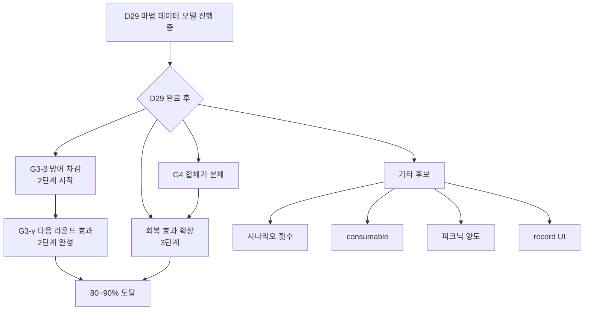

# Aster FVTT — 작업 진행 현황 (Workflow Tracker)

> 본 문서는 사용자(Sch)와 Claude가 진행한 명세 작성 STEP들의 누적 진행 현황을 트랙별로 정리합니다.
> 결정 일지는 `DECISIONS.md`, 각 명세 본문은 별도 파일 참조.
> 마지막 갱신: F2-a 사전 구현 발견 (D15·D31 시점), F 트랙 사실상 F1로 마무리. I 트랙 또는 검증 진입 준비.

---

## 트랙 한눈에 보기

```mermaid
graph LR
    subgraph A["A. 정동·후속 (완료)"]
        A1[정동판정 + 후속들]
    end

    subgraph B["B. 자원·파생 (완료)"]
        B1[craft D14 + 파생 D15]
    end

    subgraph C["C. 상태이상·페이즈 (완료)"]
        C1[AE D16 + 페이즈 D17]
    end

    subgraph D["D. 보정·포만 (완료)"]
        D1[penalties D18]
    end

    subgraph E["E. 장면 이동 (완료)"]
        E1[D19 + 부상 -2]
    end

    subgraph F["F. 회복 (F1 완료)"]
        F1[피크닉 D20]
    end

    subgraph G["G. 전투 시스템 (완료)"]
        G1[이니셔티브 D21]
        G2a[라운드 인프라 D22]
        G2b[부상/큰부상 D23]
        G3a[액션 UI D24]
        Target[캔버스 타게팅 D25]
        Dodge[회피 D26]
        Damage[대미지 적용 D27]
        OppDmg[opposed 회피 인지 D28]
        Spell[마법 데이터 모델 D29]
        G3b[G3-β 방어 차감 D31]
        G3y[G3-γ 다음 라운드 D33]
        G4[합체기 본체 D34]
        G4a[G4-α 주속성 표 D35]
        G4b[G4-β 황표·특수 D36]
        G4g[G4-γ RollTable D37]
    end

    subgraph R["R. 회복 확장 (완료)"]
        R1[R1 consumable 회복]
        R2[R2 건강 0 협력 회복]
    end

    subgraph F["F. 룰 정합 마무리 (F1으로 사실상 마무리)"]
        F1[F1 전투 종료 자동 회복 + 회복 차단]:::current
        F2pre[F2-a 포만 패널티 — D15·D31 시점 사전 구현됨]
        F2[F2-b/c 피크닉 양도·포만 0 행동 제한 — 의도적 보류]:::deferred
    end

    subgraph I["I. 아이템 시트·템플릿 정리"]
        I1[I1 기존 아이템 타입 점검·갱신]:::future
    end

    subgraph T["T. 도구 (시점 미정)"]
        T1[T1 빌드·역추출 도구]:::pending
    end

    subgraph H["H. 디자인 정리 (검증 후 최종 단계)"]
        H0[인라인 카드 템플릿 분리 D32]
        H1[채팅 카드 일관성 통일]:::future
        H2[스크린샷 기반 시트 점검]:::future
        H3[다크/라이트 테마 점검]:::future
    end

    subgraph M["M. 메타 결정"]
        D30[자동화 도달점 D30]:::meta
    end

    G1 --> G2a --> G2b --> G3a --> Target --> Dodge --> Damage --> OppDmg --> Spell
    Spell --> G3b --> G3y --> G4 --> G4a --> G4b --> G4g
    G4g --> R1 --> R2
    R2 --> F1
    F1 --> I1
    I1 -.검증 후.-> H1
    D30 -.가이드라인.-> Spell
    H0 -.기반.-> H1
    H1 --> H2
    T1 -.언제든.-> R1

    classDef current fill:#4a9eff,stroke:#0066cc,color:#fff
    classDef future fill:#444,stroke:#666,color:#aaa
    classDef pending fill:#7a8c9e,stroke:#5a6c7e,color:#fff
    classDef meta fill:#7a5c1f,stroke:#a07b2c,color:#fff
    classDef deferred fill:#5a5a3a,stroke:#7a7a4a,color:#ccc
```

**범례:** 진한 박스 = 완료, 파란 박스 = 현재 작업, 회색 박스 = 미진행, 회청 박스 = 즉시 진행 예정(완료됨), 황금 박스 = 메타 결정.

---

## 진행 흐름 시간순

| # | 결정 | 명세 | 주제 | 상태 |
|---|---|---|---|---|
| 01 | D1~D13 | (초기) | 기반 결정 | ✅ |
| 02 | — | EMOTION_ASTER_SPEC_REVISED | 정동판정 발생기 | ✅ |
| 03 | — | CRIT_FUMBLE_SPEC | 대성공/대실패 후속 | ✅ |
| 04 | — | OPPOSED_RESOLVE_SPEC | 대결판정 결합 카드 | ✅ |
| 05 | **D14** | CRAFT_REFUND_SPEC | craft 자동 차감 + 환불 (D3 갱신) | ✅ |
| 06 | **D15** | DERIVED_STATS_SPEC | 파생 스탯 | ✅ |
| 07 | **D16** | ACTIVE_EFFECT_SPEC | 피로·졸림 AE | ✅ |
| 08 | **D17** | PHASE_TRACKER_SPEC_V2 | 페이즈 트래커 | ✅ |
| 09 | — | SPELL_SLEEPY_SPEC | 마법 졸림 통합 | ✅ |
| 10 | — | SPELL_EXTRA_DICE_SPEC | 마법 추가 굴림 | ✅ |
| 11 | **D18** | SATIETY_PENALTIES_SPEC | penalties 통합 + 포만 감소 | ✅ |
| 12 | **D19** | SCENE_TRANSITION_SPEC | 장면 이동 | ✅ |
| 13 | **D20** | PICNIC_F1_SPEC | 피크닉 회복 | ✅ |
| 14 | — | INJURY_SCENE_SPEC | 부상 PC 건강 -2 (이동) | ✅ |
| 15 | **D21** | INITIATIVE_G1_SPEC | 이니셔티브 (민첩) | ✅ |
| 16 | (D21 보완) | INITIATIVE_AUTO_SPEC | 자동 굴림 + UI 정리 | ✅ |
| 17 | **D22** | ROUND_INFRA_G2A_SPEC | 라운드 인프라 | ✅ |
| 18 | **D23** | INJURY_COMBAT_G2B_SPEC | 부상/큰부상 + 전이 | ✅ |
| 19 | **D24** | COMBAT_ACTION_G3A_SPEC | 액션 UI (서브 탭) | ✅ |
| 20 | **D25** | CANVAS_TARGETING_SPEC | 캔버스 타게팅 | ✅ |
| 21 | **D26** | DODGE_MECHANISM_SPEC | 회피 판정 + 피로 -3 | ✅ |
| 22 | **D27** | DAMAGE_APPLY_SPEC | 대미지·상태이상 적용 | ✅ |
| 23 | **D28** | OPPOSED_DODGE_DAMAGE_SPEC | resolveOpposed 회피 인지 | ✅ |
| 24 | **D29** | SPELL_DATA_MODEL_SPEC | 마법 데이터 모델 확장 | ✅ |
| 25 | **D30** | D30_AUTOMATION_BOUNDARY | 자동화 도달점 정책 (메타) | 🟡 정책 |
| 26 | **D31** | DEFEND_USAGE_G3B_SPEC | G3-β 방어 차감 + 라운드 1회 제한 | ✅ |
| 27 | **D32** | INLINE_CARD_EXTRACT_SPEC | 인라인 카드 → 템플릿 분리 | ✅ |
| 28 | **D33** | NEXT_ROUND_EFFECTS_G3Y_SPEC | G3-γ 다음 라운드 효과 (집중·대쉬·차지 AP) | ✅ |
| 29 | **D34** | UNISON_G4_SPEC | G4 합체기 본체 (페어·다이스·부속성) | ✅ |
| 30 | **D35** | UNISON_G4_ALPHA_SPEC | G4-α 주속성 표 표준 효과 (적·청·녹 80%) | ✅ |
| 31 | **D36** | UNISON_G4_BETA_SPEC | G4-β 황표 + 12+ 특수 + 자해 안내 | ✅ |
| 32 | **D37** | UNISON_G4_GAMMA_ROLLTABLE_SPEC | G4-γ RollTable 통합 + 플레이버 텍스트 | ✅ |
| 33 | **D38** | R1_CONSUMABLE_HEAL_SPEC | R1 consumable 회복 (회복 진입점 확장) | ✅ |
| 34 | **D39** | R2_REVIVE_SPEC | R2 건강 0 협력 회복 (탐색 중 룰 정합) | ✅ |
| **35** | **D40** | **F1_SPEC** | **F1 전투 종료 자동 회복 + 회복 효과 차단** | 🔵 구현 대기 |
| 36 | (사전 구현) | — | F2-a 포만 패널티 (룰북 493) — D15·D31 시점 이미 구현, computePenalties 헬퍼 | ✅ 사전 |
| 37 | (보류) | — | F2-b/c 피크닉 양도·포만 0 행동 제한 — 의도적 보류 (재평가 가능) | ⏸️ |
| 38 | (예정) | I1_SPEC | I1 기존 아이템 타입 시트·템플릿 점검·갱신 | 🟦 후속 |
| 39 | (예정) | T1_PACK_TOOLING_SPEC | T1 빌드·역추출 도구 (LevelDB 관리) | 🟨 시점 미정 |

---

## 자동화 도달점 정책 (D30)

### 위치 평가

**현재 위치**: 1단계 진입 중 (D29 마법 데이터 모델로 결과 자동 추출 도입).

### 단계별 진행 계획

| 단계 | 내용 | 관련 STEP | 상태 |
|---|---|---|---|
| 1단계 | 대미지·상태이상 자동 추출 | D29 | ✅ |
| 2단계 | 1라운드 만료 AE — 액션 효과(집중·대쉬·차지) | D31 + D33 | ✅ |
| 3단계 | 명확한 회복 효과 (healHealth, cureStatus 등) | D34/D35/D36/R1/R2 — 회복 메커니즘 3진입점 완비 | ✅ |
| 정지점 | R 트랙 완료, 80~90% 도달 | — | ✅ **달성** |
| 후속 (F 트랙) | 룰북 명시 잔재 (전투 종료 자동 회복 등) | F1·F2 | 🔵 진행 |

### 권장 순서

| 순위 | 작업 | 근거 |
|---|---|---|
| 1 | **F1 전투 종료 자동 회복 + 회복 차단 구현** | 명세 작성 완료. R 트랙 자연 연장. 룰북 537 정합 |
| 2 | **I1 기존 아이템 타입 시트·템플릿 정리** | 실제 데이터 사용 패턴 기반 점검·갱신 |
| — | **검증 단계** — D31~D36 + R 트랙 + F1·I1 통합 체크리스트 진행 | 모든 기능 통합 회귀 |
| 3 | **H1 채팅 카드 일관성 통일** | 검증 후 최종 단계. D32 기반 |
| 4 | **H2 스크린샷 기반 시트 점검** | Foundry 실제 화면 첨부 |
| 5 | **H3 다크/라이트 테마 (선택)** | 두 테마에서 모두 정상 동작 |
| 6 | T1 도구 트랙 (시점 미정) | 필요 시점에 진행 |
| — | (의도적 보류) F2-b·F2-c, 시나리오 트래커, record UI 등 | 재평가 후 결정 |

### 의도적 미선택

D&D 완전 모델(모든 효과를 데이터 카테고리화)은 *비용 대비 가치 부족*으로 미선택. 사유는 D30 결정 일지 참조.

---

## R 트랙 — 회복 확장 (완료)

D30 3단계의 *정점*. 합체기 회복 헬퍼 3종(`applyCureStatus`, `applyHealHealth`, `applyCureAllStatus`)이 누적된 상태에서 *피크닉 외 회복 진입점* 추가 완료.

### R1 — consumable 회복 ✅

D38. consumable 데이터 모델에 `healHealth` + `cureStatus[]` + `cureAllStatus` 추가. 인벤토리 액션 버튼·아이템 시트 "사용" 버튼 두 진입점. 합체기 회복 헬퍼 3종 전면 재사용. 사용 후 아이템 삭제. 자기 사용. 결과 카드 `consumable-card` 신규.

### R2 — 건강 0 협력 회복 ✅

D39. 룰북 535 협력 회복 메커니즘 자동화. 탐색 중 PC 건강 0 도달 시, 시트의 "협력 회복 신청" 버튼 → PC 전원 포만 -2 검사·차감 → 행동불능 PC 건강 1 회복. 전투 중은 룰북 537 정합으로 *회복 불가 안내*만. 결과 카드 `revive-card` 신규.

### D30 3단계 완성

회복 메커니즘이 *합체기 + consumable + 협력 회복* 세 진입점 완비. 정점 도달.

---

## F 트랙 — 룰 정합 마무리 (F1으로 사실상 마무리)

### 진입 시점

R 트랙 후. *기능 완성도 우선* 사용자 의도에 따라 *디자인 정리(H 트랙) 전*에 룰북 명시 잔재 처리.

### F1 — 전투 종료 자동 회복 + 회복 효과 차단

**범위**: 룰북 537 후반·전반 모두 정합:
- 전투 종료 시 행동불능 PC 자동 건강 1 회복 (D23 흐름 확장)
- 전투 중 행동불능 PC에 회복 효과(applyHealHealth·R1 consumable 등) 차단
- 상태이상 회복은 차단 안 함 (룰북 엄밀 해석)

**상태**: D40 명세 작성 완료, 구현 대기 (🔵).

### F2-a — 포만 패널티 (룰북 493) — *사전 구현됨*

**발견**: D15·D31 시점에 `module/helpers/roll-result.mjs`의 `computePenalties`에 *이미 완전 구현*. 룰북 493의 4단계 수치(11+/10-/5-/0 = 0/-1/-2/-3) 완전 일치.

**호출 흐름**:
- `rollAbility` — 일반 판정
- `rollDodge` — 회피 판정 (+ 피로 -3)
- `spell-roll.mjs` — 마법 판정

**카드 표시**: `roll-asterabl.html`, `roll-asterabl-vs.html`에 `{{#if penalties.satiety}}` 분기로 패널티 라인 표시.

**i18n**: `ASTER.label.satiety` 활용.

**결정 일지 기록**: 별도 결정 일지 항목 *없음* — D15/D31 시점에 *자연스럽게 들어간 후속 회수*. 사용자 결정으로 *별도 D 번호 부여 안 함*. F 트랙 사전 구현 영역으로 기록만.

### F2-b, F2-c — 의도적 보류

다음 영역은 *룰북 명시*이지만 *현재 시스템 가치·시점 평가 결과* 보류:

- **F2-b 피크닉 양도** — D20 흐름 확장. R1 consumable 도입으로 *상대적 가치 감소*. 룰북 ~500 영역 (회복량 일부 양도 + 추가효과는 만든 PC만).
- **F2-c 포만 0 행동 제한** — 룰북 98 ("일정치 이하로 내려가면 마음대로 행동할 수 없게"). *행동 차단 메커니즘*은 시스템 전반 영향, *룰북의 "일정치" 정의 모호*.
- **시나리오 2회 제한** (피크닉) — *시나리오* 단위 인프라 별도 필요.
- **배고픔 상태이상의 포만 감소 배율** — 룰북 492 (배고픔 시 포만 감소량 2). 현재 시스템 구현 상태 확인 필요.

이 영역들은 *재평가 가치 있을 시 별도 트랙* 진행. 현재는 H 트랙 진입에 우선순위.

---

## I 트랙 — 아이템 시트·템플릿 정리

### 진입 시점

F 트랙 후. *실제 데이터 사용 패턴 기반* 기존 아이템 타입 점검·갱신.

### I1 — 기존 아이템 타입 시트·템플릿 점검·갱신

**범위 — 해석 A**: 기존 아이템 타입(bag, food, weapon, equipment, consumable, spell 등)의 시트와 템플릿을 *실제 게임 운영 사용 패턴*에 맞춰 정리.

작업 자산:
- 각 타입의 *데이터 필드 점검* — 누락 필드·불필요 필드·룰 정합 결손 영역
- 시트 UI 점검 — 입력 가능 영역·표시 우선순위·사용자 경험
- 템플릿 점검 — 인벤토리 표시·아이템 카드 표시
- 데이터 모델 갱신 필요 시 처리 (마이그레이션 고려)

**STEP 분할 가능성**: I1을 *아이템 타입별*로 더 나눌 수 있음 (예: I1a bag, I1b food 등). 시작 시점에 *현재 상태 점검 후* 분할 여부 결정.

### I 트랙 의도적 미포함

- 시드 아이템 데이터 작성 (해석 B) — *추후 평가*
- 새 아이템 타입 추가 — 룰북 명시 없으면 보류

---

## 검증 단계

### 진입 시점

I 트랙 후, H 트랙 *진입 전*. 사용자 의도 — *테스트 후 최종 단계로 H 트랙*.

### 검증 자산

- `INTEGRATION_TEST_D31_D36.md` — D31~D36 통합 시나리오
- `INTEGRATION_TEST_R_TRACK.md` — R1·R2 통합 시나리오
- *F 트랙 검증 시나리오* — F1·F2 진행 시 추가 (별도 또는 R 트랙에 포함)
- *I 트랙 검증 시나리오* — I1 진행 시 추가

### 검증 흐름

1. D31~D36 체크리스트 진행
2. R 트랙 체크리스트 진행
3. F·I 트랙 누적분 추가 진행
4. 발견된 결함 종합 → 해결 또는 의도적 미해결 결정
5. **검증 완료 후 H 트랙 진입**

---

## T 트랙 — 도구 (시점 미정)

### 진입 시점

언제든 가능. R 트랙·H 트랙과 *독립*. LevelDB pack 작업이 *빈번*해질 때 진행.

### T1 — 빌드·역추출 도구

**범위**:
- `build:packs:watch` (영역 A1) — 소스 변경 시 자동 재빌드
- 소스 JSON 스키마 검증 (영역 A2) — 빌드 전 필수 필드 체크 + 명확한 에러
- `extract:packs` 명령 (영역 B1) — Foundry 내 RollTable·Macro → 소스 JSON 역추출
- 문서화 — `docs/PACK_DEVELOPMENT.md` 추가

**배경**: G4-γ RollTable 빌드 시행착오 경험 (`_key` 누락, classic-level 누적 등). 현재 `tools/build-packs.mts`로 *해결됨*. T1은 *재발 방지 + 워크플로우 강화*.

### T 트랙 의도적 한계

C(UX 관리) · D(외부 데이터 확장)는 *현재 시점 가치 작음*. 필요해질 시점에 별도 트랙으로 평가.

---

## H 트랙 — 디자인 정리 (기능 완료 후 진행)

### 진입 시점

R·F·I 트랙 *모두 완료* + *검증 단계* 후. 사용자 의도 — *H 트랙은 테스트 후 최종 단계*. 디자인 트랙을 기능 트랙과 분리한 이유:
- 새 기능 STEP에서 카드·시트 구조가 바뀔 수 있어, 미리 통일해도 다음 STEP에서 깨질 가능성
- 디자인 정책 결정은 *모든 자산을 보고 + 검증을 통과한 후* 결정하는 게 합리적
- *검증에서 발견된 UX 이슈*가 H 트랙 우선순위 결정의 자료가 됨

### H 트랙 STEP 후보

| STEP | 내용 | 분량 |
|---|---|---|
| **H0 (D32, 즉시)** | 인라인 카드를 .html 템플릿으로 분리 — *후속 정리의 기반* | 작음 |
| **H1 (예정)** | 채팅 카드 일관성 통일 — header/footer 패턴, source 이미지 정책, 색상 의미 정책 | 중 |
| **H2 (예정)** | 스크린샷 기반 시트 디자인 점검 — padding·여백·비율 미세 조정 | 중~큼 |
| **H3 (선택)** | 다크/라이트 테마 일관성 점검 | 중 |

### H0이 *지금* 진행되는 이유

다른 H STEP은 H 트랙 진입 시 결정하지만, H0(인라인 카드 분리)는 **사전 정리 성격**:
- 인라인 카드(JS 안의 문자열로 생성)는 SCSS 일관성 점검 시 *동기 누락 위험*
- 향후 디자인 변경 시 한 곳만 수정해도 *모든 카드에 적용되도록* 코드 구조 정리
- H1~H3의 *기반*

### 카드 일관성 가이드 (H1에서 정식 결정될 후보)

H1 진입 전까지의 가이드라인 — 새 카드 추가 시 참고:

**1. 컨테이너**
- 항상 `
` 사용
- 인라인 문자열 생성 금지 — `templates/chat/*.html` 또는 `templates/chatcard/*.html`에 분리
- 추가 클래스(`spell-color-red`, `picnic-card` 등)는 카드 종류별 *시각 차이*가 있을 때만

**2. 헤더 구조**
- `<header class="card-header">` 컨테이너
- 액터 컨텍스트가 있으면 `` 표시 (36×36, border-radius 4px)
- `
` 안에 `.name`(굵게)과 `.formula`(보조 정보) 두 줄

**3. 본문 영역**
- 판정 결과는 `
` (텍스트 중앙 정렬, 1.1rem 굵게)
- 효과·부가 정보는 `
` 또는 비슷한 블록
- 라벨은 `.label` 클래스 (0.7rem, opacity 0.6)

**4. 액션 버튼**
- GM 전용 버튼은 카드 하단에 배치 — *향후 H1에서 `.card-footer` 또는 `.card-actions` 공통 클래스 정식화 예정*
- `data-action` 속성으로 hook 핸들러 연결

**5. 색상 의미 (H1에서 정식 결정)**
- 마법 카드만 색 분기 (`.spell-color-{red|blue|green|yellow|black}`)
- 대결판정 승자 강조는 색이 아닌 *볼드·테두리*로 표현 권장 (잠정)
- 성공/실패 verdict는 기존 `.verdict.success` / `.verdict.fail` 패턴 유지

**6. flag 패턴 (D27 정착)**
- 액션 카드: `combatAction: { type, sourceActorId, targetActorId, ... }`
- 마법 카드: `spellCast: { sourceActorId, targetActorId, defaultDamage, defaultStatus, ... }`
- opposed 결과: `opposedDamage: { targetActorId, ... }` (회피 패배 시)
- 중복 적용 방지: `damageApplied: false → true` 토글 일관

> **이 가이드는 가이드라인이지 강제 규약 아님.** H1 진입 시 위 항목들 중 어느 것을 정식 규약으로 채택할지 결정. 그때까지 새 카드 추가 시 *참고*.

---

## 자동화 완성도 (도메인별)

### 게임 루프 (탐색·정보수집 페이즈)

| 룰북 항목 | 자동화 | 비고 |
|---|---|---|
| 일반 판정 / 대결판정 / 정동판정 | ✅ | |
| 대성공/대실패 후속 | ✅ | |
| 마법판정 (졸림·추가 굴림·다이스 선택) | ✅ | |
| 마법 효과 자동 추출 (대미지·상태이상) | 🔵 | D29 진행 중 |
| 졸림·포만 보정 | ✅ | |
| 포만 자동 감소 (판정·이동) | ✅ | |
| 피크닉 회복 (자기) | ✅ | 양도는 보류 |
| 부상 -2 (탐색 이동) | ✅ | |

### 전투 루프

| 룰북 항목 | 자동화 | 비고 |
|---|---|---|
| Combat 진입 + 이니셔티브 | ✅ | |
| 라운드 인프라 (AP 굴림·재이니셔티브) | ✅ | |
| 행동완료 부상 -2 / 큰부상 -5 | ✅ | |
| 큰부상 → 부상 전이 (전투 종료) | ✅ | |
| 액션 선언 UI + AP 차감 | ✅ | |
| 캔버스 타게팅 (돌던지기·마법) | ✅ | |
| 회피 판정 + 피로 -3 | ✅ | |
| 대미지·상태이상 적용 (수동) | ✅ | GM 클릭 |
| resolveOpposed 회피 인지 | ✅ | |
| **방어 액션 차감 (다음 대미지 -1d6)** | ❌ | G3-β |
| **라운드당 1회 제한 (방어·차지)** | ❌ | G3-β |
| **다음 라운드 효과 (집중·대쉬)** | ❌ | G3-γ (2단계) |
| **합체기 본체** | ❌ | G4 |
| 회피 판정 -3 (피로) | ✅ | D26 |
| 미션 처리 | ❌ | 자유 형태 — 의도적 미선택 |

### 회복·자원

| 룰북 항목 | 자동화 | 비고 |
|---|---|---|
| 피크닉 (자기 적용) | ✅ | |
| 피크닉 양도 | ⏸️ | 보류 |
| 시나리오 2회 제한 | ❌ | 후보 |
| consumable 회복 | ❌ | 후보 (3단계) |
| 건강 0 회복용 포만 -2 | ❌ | 후보 |
| 합체기 상태이상 회복 | ❌ | G4 묶임 (3단계) |

---

## 후속 작업 후보 (D29 완료 후)

### 권장 순서 (D30 가이드라인 적용)

| 순위 | 작업 | 근거 |
|---|---|---|
| 1 | **D35 G4-α 주속성 표 표준 효과 구현** | 명세 완료. UNISON_TABLES + 자동 효과 적용 |
| 2 | **G4-β 황표 + 12+ 특수 케이스** | 황표 1라운드 감소 AE, 12+ 특수 처리. UNISON_TABLES 확장 |
| 3 | **G4-γ RollTable 통합 + 플레이버 텍스트** | Foundry RollTable로 description 자동 출력. G4-γ의 *재정의* 형태 |
| 4 | 회복 효과 확장 (consumable 등) | G4-α의 applyHealHealth 헬퍼 재사용. D30 3단계 완성 |
| — | (정지점 — D30, 80~90% 도달) | 남은 자유 효과는 GM 수동 |
| 5 | **H1 채팅 카드 일관성 통일** | 정지점 이후. 인라인 카드 분리(D32) 기반 위에서 |
| 6 | **H2 스크린샷 기반 시트 점검** | 실제 Foundry 화면 첨부 후 미세 조정 |
| 7 | **H3 다크/라이트 테마 (선택)** | 두 테마에서 모두 정상 동작 확인 |
| 8 | 시나리오 횟수 트래커 (선택) | 피크닉 2회 제한 등 |
| 9 | record UI (선택) | 게임 외부 트랙 |

---

## 코드 자산 누적

### 순수 함수 (helpers)
- `helpers/roll-result.mjs` — `detectCritFumble`, `resolveOpposed`, `computePenalties(actor, context)` (context 인자 확장)
- `helpers/spell-roll.mjs` — `computeSpellRoll` (penalties 인자)
- `helpers/badstatus-effects.mjs` — Active Effect 정의 (피로 speed -3)
- `helpers/world-values.mjs` — `WORLD_VALUES`, `PHASES`
- `helpers/dice-select.mjs` — `pickDiceDialog` 범용 헬퍼
- `helpers/target-select.mjs` — `getTargetedTokens` 범용 헬퍼

### 효과 적용 헬퍼 (aster.mjs)
- `applyDamageFromCard(message)` — 일반 카드(combatAction/spellCast) 진입
- `applyDamageFromOpposed(message)` — opposed-result 카드 진입
- `promptDamageDialog(target, defaultDamage, defaultStatus)` — 공통 다이얼로그
- `applyDamageAndStatus(target, amount, statusList)` — 공통 적용 로직
- `renderDamageResultCard(target, ...)` — 공통 결과 카드
- `DAMAGE_STATUSES` 상수 — 5가지 상태이상 정의

### 클래스
- `documents/actor.mjs` (AsterActor) — `_decreaseSatietyIfExploration`, `_applyInjuryHealthLoss`, `_applyBigInjuryHealthLoss`, `_transitionBigInjuryToInjury`, `_applyInjuryHealthLossIfExploration`, `rollDodge`
- `documents/combat.mjs` (AsterCombat) — `_sortCombatants`, `_autoRollInitiative`, `_startRound`, `_endTurn`, `_endCombat`
- `apps/gm-panel.mjs` (AsterGMPanel) — `#onSceneTransition`, `#onSetPhase`, `#onEmoGenerate`, …
- `sheets/actor-sheet.mjs` — `#onCombatAction`, `#onPicnicDeclare`, `#onSpellCast`, `#processSpellRoll`, `#onRollDodge`, …

### Combatant flag 패턴 (전투 임시 상태)
- `aster.actionPoint` — 라운드별 액션 포인트
- `aster.unisonReady` — 합체기 준비 상태

### 채팅 카드 패턴
- roll-asterabl (일반판정) / roll-asterabl-vs (대결판정·회피) / roll-asterabl-emo (정동)
- spell-card (마법판정)
- picnic-card (피크닉)
- opposed-result (대결판정 결합 결과)
- combat 카드들 (라운드 시작·부상 적용·전투 종료 전이·액션 선언·대미지 결과)

---

## G4-α / G4-β 범위 정의 (룰북 합체기표 자동화)

### 표 구조 분석 (룰북 합체기표 4종)

룰북의 합체기표 4종은 **80%가 정형 패턴**, 나머지 20%가 특수 케이스. 분할 기준은 *정형 vs 특수*.

| 색 | 합산 5~11 표준 효과 | 12+ 특수 | 합산 2 특수 (자해) |
|---|---|---|---|
| 적 | 적 1체 N대미지 | 적 1체 10대미지 | 적 1체 7대미지 + **자해**(시전자 행동완료) |
| 청 | 아군 모두 N건강 회복 | 12 회복 + **상태이상 전부 치료** | 8 회복 + **자해** |
| 녹 | 적 전체 N대미지 | 적 전체 6대미지 | 적 1체 7대미지 + **자해** |
| 황 | 아군 받는 대미지 -N (1라운드) | **모든 대미지 무효** | 적 1체 7대미지 + **자해** |

### G4-α (다음 STEP)

**범위**: 적·청·녹 표의 *대미지/회복 효과* + 황표의 *대미지 감소 AE*.

자동화 대상:
- 합산 5~11: 적·청·녹의 단순 효과 (단일 적 대미지 / 전체 적 대미지 / 전체 아군 회복)
- 황표 5~11: 1라운드 대미지 감소 AE (D33 1라운드 AE 패턴)
- 표 데이터 정의 (`UNISON_TABLES` 상수)
- `lookupUnisonEffect(color, total)` 헬퍼
- `applyHealHealth(actors, amount)` 신규 헬퍼

미포함 (G4-β로 미룸):
- 합산 12+의 특수 케이스 (상태이상 전부 치료 / 모든 대미지 무효)
- 합산 2의 자해 효과 (안내만)
- 황표의 정확한 *수신 측 감소* 통합 (applyDamageAndStatus 확장 필요)

### G4-β (후속)

**범위**: 12+ 특수 + 황표 통합 + 자해 안내.

자동화 대상:
- 청표 12+ 상태이상 전부 치료 (`applyCureStatus` 5번 또는 일괄 헬퍼)
- 황표 12+ 무효 효과 (1라운드 차단 flag)
- 황표 5~11 → applyDamageAndStatus에 *수신 측 감소* 분기 통합
- 적표 2 자해 효과 → "시전자 다음 라운드 행동완료" 안내 (D12 자동화 경계)

### G4-γ (RollTable 통합 + 플레이버 텍스트)

**범위 — 재정의**: Foundry RollTable을 활용한 룰북 합체기표 텍스트 자동 출력. 효과 적용은 시스템 코드(`UNISON_TABLES`)가 그대로 통제. G4-γ가 원래 *플레이버 텍스트 i18n*이었는데, RollTable이 *바로 그 역할*을 함.

**핵심 정책 (사용자 확정)**:
- **옵션 C** — RollTable은 *텍스트 출력 도구*로만. 효과 적용은 시스템 코드. D30 정합.
- **옵션 다** — 단일 언어(한국어) 시작. 다국어는 후속.
- 적·청·녹·황 4색 표를 RollTable JSON pack으로 배포.
- 합산값 결정 후 `table.getResultsForRoll(total)`로 description 조회 → 채팅 카드에 자동 표시.
- G4-α/β의 자동 적용 결과와 함께 한 카드에 통합.

**작업 범위**:
- 4개 RollTable JSON 작성 (적·청·녹·황)
- `system.json`의 `packs` 등록
- 시스템 초기화 시 RollTable 존재 검증 + fallback (pack 미로드 또는 GM 삭제 케이스)
- `_renderUnisonCard` 확장 — description 라인 추가
- `UNISON_TABLES` 상수와 RollTable 동기 관리 (합산값 키 일치)

**진행 시점**: G4-β 완료 후. 4색 표 전체의 효과 자동화가 끝난 상태에서 텍스트 통합이 자연.

**D30 정책 위치**: G4-γ 완료 시 D30 정책 80~90% 도달점. 이후 H 트랙(디자인 정리) 진입.

### G4-α의 D30 정책 위치

G4-α 완료 시 D30 3단계가 **사실상 완성** — 회복 효과의 두 가지 진입점(`applyCureStatus`, `applyHealHealth`)이 모두 시스템에 들어옴. G4-β는 *예외 케이스 마무리*. G4-γ는 *RollTable 통합*으로 플레이버 텍스트 자동 출력.

> G4-γ 후가 D30 80~90% 도달점. 그 시점에 H 트랙(디자인 정리)으로 진입.
